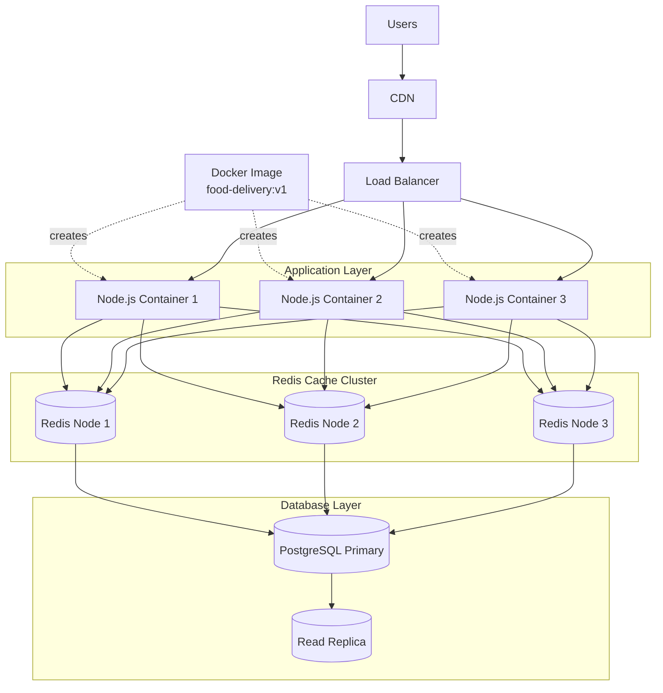

```mermaid
flowchart TD

    U[Users]

    CDN[CDN]
    LB[Load Balancer]

    Docker[Docker Image<br/>food-delivery:v1]

    subgraph APP["Application Layer"]
        A1[Node.js Container 1]
        A2[Node.js Container 2]
        A3[Node.js Container 3]
    end

    subgraph CACHE["Redis Cache Cluster"]
        R1[(Redis Node 1)]
        R2[(Redis Node 2)]
        R3[(Redis Node 3)]
    end

    subgraph DATA["Database Layer"]
        DB[(PostgreSQL Primary)]
        Replica[(Read Replica)]
    end

    U --> CDN
    CDN --> LB

    Docker -. creates .-> A1
    Docker -. creates .-> A2
    Docker -. creates .-> A3

    LB --> A1
    LB --> A2
    LB --> A3

    A1 --> R1
    A1 --> R2
    A1 --> R3

    A2 --> R1
    A2 --> R2
    A2 --> R3

    A3 --> R1
    A3 --> R2
    A3 --> R3

    R1 --> DB
    R2 --> DB
    R3 --> DB

    DB --> Replica
```