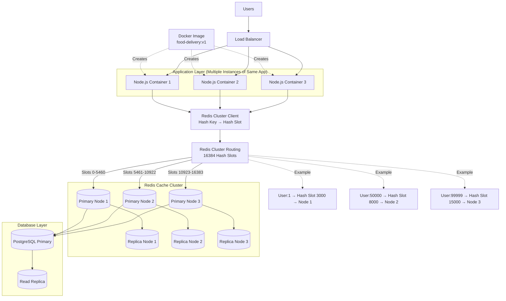

# Redis Cache Cluster - Complete Architecture

---

## What is a Cache Cluster?

A Cache Cluster is a group of Redis servers working together as a single logical cache.

Instead of:

Redis

You have:

- Redis Node 1
- Redis Node 2
- Redis Node 3

Together they form a Redis Cluster.

---

## Why Use a Cache Cluster?

### More Memory

Single Redis:

- 16 GB RAM

Cluster:

- Node 1 = 16 GB
- Node 2 = 16 GB
- Node 3 = 16 GB

Total = 48 GB

---

### More Throughput

Single Redis:

- 100K requests/sec

Cluster:

- Node 1 handles part of traffic
- Node 2 handles part of traffic
- Node 3 handles part of traffic

Total throughput increases significantly.

---

### Fault Tolerance

If:

- Primary Node 2 crashes

Then:

- Replica Node 2 becomes Primary

Traffic continues with minimal disruption.

---

## Who Chooses the Redis Node?

The application does NOT choose.

Node.js simply executes:

GET User:7000

The Redis Cluster Client:

1. Hashes the key
2. Computes a hash slot
3. Determines which Redis node owns that slot
4. Sends request to that node

---

## How Sharding Works

Redis Cluster contains:

16384 hash slots

Example distribution:

- Node 1 → Slots 0-5460
- Node 2 → Slots 5461-10922
- Node 3 → Slots 10923-16383

Examples:

- User:1 → Slot 3000 → Node 1
- User:50000 → Slot 8000 → Node 2
- User:99999 → Slot 15000 → Node 3

This distribution of data across nodes is called:

SHARDING

---

## Real Request Flow

User
↓
Load Balancer
↓
Node.js Container
↓
Redis Cluster Client
↓
Hash Key
↓
Compute Hash Slot
↓
Correct Redis Node
↓
Return Cached Data

If Cache Miss:
↓
Database
↓
Store Result Back Into Cache

---

## Interview Definition

A Redis Cache Cluster is a collection of Redis nodes that work together to provide higher memory capacity, increased throughput, fault tolerance, and horizontal scalability. Data is distributed across nodes using sharding through hash slots, and the Redis Cluster automatically routes requests to the correct node based on the cache key.