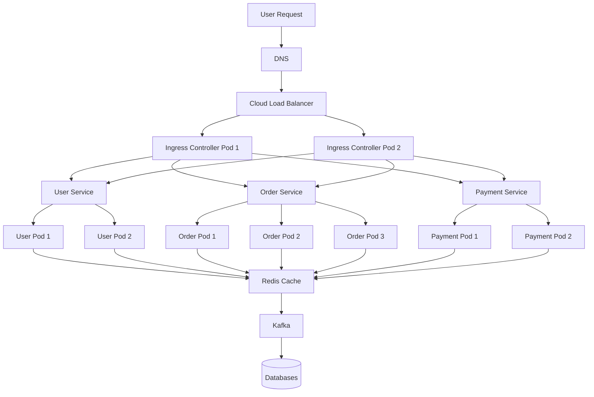

# Kubernetes Request Flow (Ingress, Service, Pods)



## Who Decides What?

### 1. Load Balancer

Responsible for:

* Choosing which Ingress Controller receives the request.

Example:

User Request
→ Ingress Pod 1

or

User Request
→ Ingress Pod 2

---

### 2. Ingress Controller

Responsible for:

* Choosing which Service receives the request.

Examples:

/users/*  → User Service

/orders/* → Order Service

/pay/*    → Payment Service

---

### 3. Kubernetes Service

Responsible for:

* Choosing which Pod receives the request.

Example:

Order Service
|
+-- Order Pod 1
+-- Order Pod 2
+-- Order Pod 3

If a request arrives:

Order Service
→ Order Pod 2

---

### 4. Pod

Responsible for:

* Running application code.
* Executing business logic.
* Calling Redis, Kafka, databases, external APIs.

Example:

Order Pod
→ Create Order
→ Save Order
→ Publish Event

---

## Complete Request Journey

User
→ DNS
→ Load Balancer
→ Ingress Controller
→ Kubernetes Service
→ Pod
→ Redis / Kafka / Database
→ Response

---

## Key Interview Definitions

Pod:
Smallest deployable unit in Kubernetes. Usually contains one application container.

Service:
Stable endpoint that load-balances traffic across multiple pod replicas.

Ingress Controller:
Routes incoming HTTP/HTTPS traffic to the correct Kubernetes Service based on path or hostname.

Load Balancer:
Distributes incoming traffic across Ingress instances.

---

## One-Line Summary

Load Balancer chooses Ingress.
Ingress chooses Service.
Service chooses Pod.
Pod executes the request.
Database stores the data.

```
```
