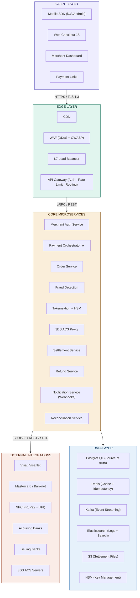
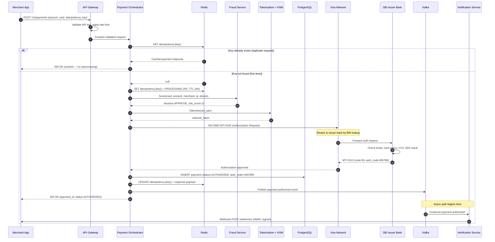
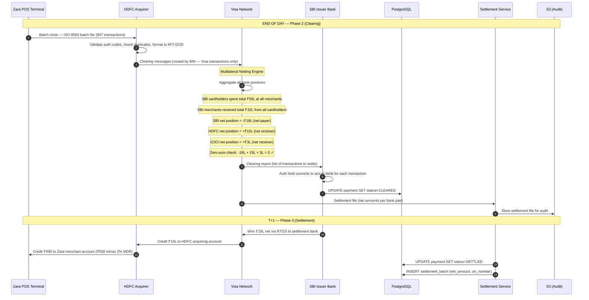
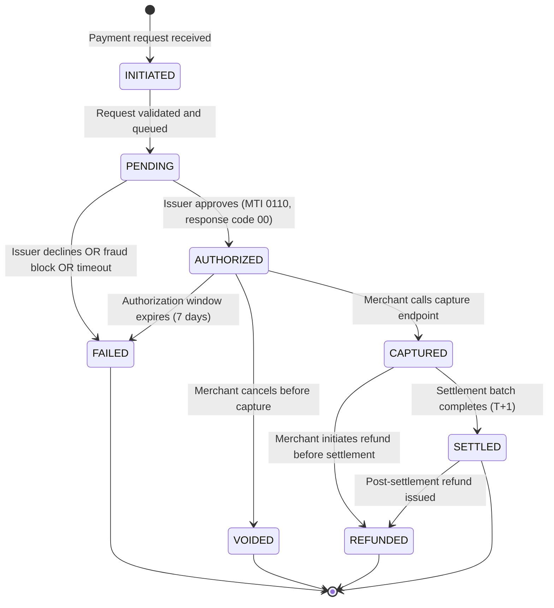
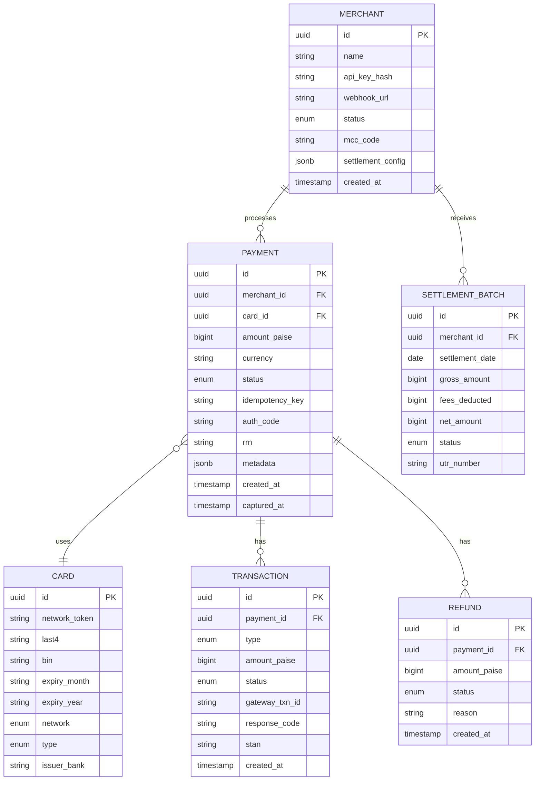

# Payment Gateway — Complete System Design

> **SDE 1–2 Google-level reference.** Architecture, data models, APIs, key design decisions, and interview cheat sheet — all in one place.

---

## Table of Contents

1. [System Architecture](#1-system-architecture)
2. [Functional Requirements](#2-functional-requirements)
3. [Non-Functional Requirements](#3-non-functional-requirements)
4. [Core Components](#4-core-components)
5. [Authorization Flow — Sequence Diagram](#5-authorization-flow--sequence-diagram)
6. [Clearing + Settlement Flow](#6-clearing--settlement-flow)
7. [Payment State Machine](#7-payment-state-machine)
8. [Data Model — ER Diagram](#8-data-model--er-diagram)
9. [API Design](#9-api-design)
10. [Key Design Decisions](#10-key-design-decisions)
11. [Scaling Strategy](#11-scaling-strategy)
12. [Security + PCI-DSS](#12-security--pci-dss)
13. [Interview Cheat Sheet](#13-interview-cheat-sheet)

---

## 1. System Architecture



---

## 2. Functional Requirements

| Priority | Requirement | Details |
|----------|-------------|---------|
| **Core** | Accept card payments | Visa, Mastercard, RuPay, Amex — credit and debit |
| **Core** | UPI + Wallet payments | NPCI UPI, PhonePe, GPay, Paytm wallet |
| **Core** | Authorization + Capture (dual-message) | Delayed capture, partial capture, auto-capture |
| **Core** | Full and partial refunds | Same-day reversal before settlement |
| **Core** | 3D Secure (3DS2) | Frictionless + challenge flow, liability shift |
| **Core** | Webhook notifications | HMAC-SHA256 signed, retry with exponential backoff |
| **Feature** | Recurring payments | e-NACH mandates, card-on-file subscriptions |
| **Feature** | Smart routing | Route to acquirer by real-time success rate per BIN |
| **Feature** | Multi-currency / DCC | Real-time FX rates, Dynamic Currency Conversion |
| **Feature** | Payment Links | No-code payment collection for merchants |
| **Ops** | Settlement + Reconciliation | T+1/T+2, net settlement, mismatch auto-alerting |
| **Ops** | Dispute management | Chargeback handling, evidence submission workflows |
| **Ops** | Merchant dashboard | Analytics, payout tracking, API key management |

---

## 3. Non-Functional Requirements

| Metric | Target | Rationale |
|--------|--------|-----------|
| **Availability** | 99.99% uptime | ≤52 min/year. Multi-region active-active |
| **Auth Latency P99** | < 500ms | Network RTT ~200ms. Internal budget ≤300ms |
| **Throughput** | 100,000 TPS peak | Festival sales, IPL tickets, flash sales |
| **Durability** | Zero data loss | WAL + synchronous replication. RPO = 0 |
| **Security** | PCI-DSS Level 1 | No raw PAN storage. TLS 1.3. Annual QSA audit |
| **Idempotency** | Exactly-once | Redis keys. No double charge under any failure |
| **Consistency** | Strong / ACID | PostgreSQL. Saga for distributed txns. No eventual consistency for money |
| **RTO** | < 30 seconds | Automatic failover to secondary region |
| **Observability** | Full distributed tracing | Jaeger + Prometheus + ELK stack |

---

## 4. Core Components

### 4.1 API Gateway
Routes all inbound traffic. Responsibilities: merchant API key validation, JWT verification, per-merchant rate limiting (e.g. 500 req/s), request logging, SSL termination, and routing to downstream microservices.

---

### 4.2 Payment Orchestrator ⭐
The brain of the entire system. Owns the complete payment lifecycle:

1. Receives validated request from API Gateway
2. Checks Redis for idempotency key (prevents double charges)
3. Calls Fraud Detection synchronously
4. Calls Tokenization to convert PAN → network token
5. Builds and sends ISO 8583 MTI 0100 (Authorization Request) to card network
6. Receives MTI 0110 (Authorization Response), persists to PostgreSQL
7. Publishes event to Kafka
8. Returns response to merchant

---

### 4.3 Fraud Detection Service
Runs **synchronously** on the auth critical path. Checks:

- **Velocity rules** — same card > 5 txns / 10 min → flag
- **ML model score** — trained on historical fraud patterns, returns 0–100 risk score
- **Device fingerprint** — JS-captured device ID cross-referenced against known fraud devices
- **IP reputation** — blocklist of known fraud IPs and VPN exits
- **BIN-level anomaly** — unusual transaction pattern for this card's issuing geography

Returns: `APPROVE` / `REVIEW` / `DECLINE` with a risk score.

---

### 4.4 Tokenization Service + HSM

Raw PAN never stored on application servers.

- On first use: calls **Visa Token Service** or **Mastercard MDES** → returns a network token (16 digits, same format as real card number)
- Subsequent uses: reuse the cached network token
- **HSM (Hardware Security Module)**: FIPS 140-2 Level 3 tamper-proof hardware. Holds all encryption keys. Keys never leave HSM in plaintext. Handles signing, encryption, and decryption.

---

### 4.5 Settlement Service
Runs as a scheduled batch job at end of business day:

1. Queries PostgreSQL for all `CAPTURED` payments not yet cleared
2. Groups by card network (Visa, Mastercard, RuPay)
3. Generates ISO 8583 MTI 0220 (Financial Presentment) clearing messages
4. Transmits clearing files to respective card networks
5. Card network runs **multilateral netting** — calculates net positions across all banks
6. Stores settlement files to S3 for audit trail

---

### 4.6 Notification Service
Consumes `payment.*` events from Kafka:

- Sends HTTPS `POST` to merchant webhook URL
- Payload includes `HMAC-SHA256` signature (key = merchant's webhook secret)
- On failure: exponential backoff (1s → 2s → 4s → ... → 72h max)
- After max retries: dead letter queue → ops alert + merchant notification

---

### 4.7 Reconciliation Service
Runs post-settlement. Compares **three** sources:

1. Internal PostgreSQL payment records
2. Clearing files received from card networks
3. Settlement credit advice from acquiring banks

Every transaction must match across all three. Mismatches (called **exceptions**) are auto-categorized and escalated based on amount thresholds.

| Exception Type | Cause |
|----------------|-------|
| Timing difference | Network cleared, merchant not yet captured |
| Amount difference | Interchange rate dispute between banks |
| Ghost transaction | Exists at network level, absent in internal DB |
| Duplicate | Same transaction appears twice in clearing file |

---

## 5. Authorization Flow — Sequence Diagram



---

## 6. Clearing + Settlement Flow



---

## 7. Payment State Machine



### Allowed State Transitions

| From | To | Trigger | ISO 8583 Message |
|------|----|---------|-----------------|
| INITIATED | PENDING | Request validated | — |
| PENDING | AUTHORIZED | Issuer approves | MTI 0110 code 00 |
| PENDING | FAILED | Decline / fraud / timeout | MTI 0110 non-00 code |
| AUTHORIZED | CAPTURED | `POST /payments/{id}/capture` | MTI 0220 |
| AUTHORIZED | VOIDED | `POST /payments/{id}/void` | MTI 0420 (Reversal) |
| AUTHORIZED | FAILED | Auth expires | Automatic expiry |
| CAPTURED | SETTLED | Settlement batch runs | MTI 0220 + netting |
| CAPTURED | REFUNDED | `POST /payments/{id}/refund` | MTI 0400 |
| SETTLED | REFUNDED | `POST /refunds` | MTI 0400 |

---

## 8. Data Model — ER Diagram



### Key Schema Decisions

| Decision | Reason |
|----------|--------|
| `amount_paise` as `BIGINT` | Never use `FLOAT` for money. Floating-point precision errors. Paise avoids decimals |
| `idempotency_key` as `UNIQUE` DB constraint | Secondary safety net in addition to Redis. Database-level guarantee |
| `network_token` instead of raw PAN | PCI-DSS: raw card data never in the database. Ever |
| `status` as `ENUM` | Constrains to valid states at DB level. Prevents garbage state from bugs |
| Separate `TRANSACTION` table | Every ISO 8583 message (auth, capture, reversal, refund) gets its own immutable row — full audit trail |
| `SETTLEMENT_BATCH` separate table | Reconciliation source of truth. Links to actual bank UTR numbers |
| Monthly partitioning on `payments.created_at` | Old partitions archive to cold storage. Hot data stays fast |

---

## 9. API Design

### Core Endpoints

```
POST   /v1/payments                       Create and authorize a payment
GET    /v1/payments/{id}                  Get payment status
POST   /v1/payments/{id}/capture          Capture an authorized payment
POST   /v1/payments/{id}/void             Void an authorized payment (pre-capture)
POST   /v1/payments/{id}/refund           Refund a captured or settled payment
GET    /v1/payments/{id}/transactions     All ISO 8583 messages for this payment

POST   /v1/refunds                        Standalone refund endpoint
GET    /v1/refunds/{id}                   Get refund status

GET    /v1/settlement/batches             List settlement batches
GET    /v1/settlement/batches/{id}        Get batch detail with all transactions

GET    /v1/merchants/me                   Merchant account info
POST   /v1/webhooks                       Register webhook endpoint
DELETE /v1/webhooks/{id}                  Remove webhook
```

### Create Payment — Request

```json
POST /v1/payments
Authorization: Bearer sk_live_abc123...
X-Idempotency-Key: 550e8400-e29b-41d4-a716-446655440000
Content-Type: application/json

{
  "amount": 50000,
  "currency": "INR",
  "payment_method": {
    "type": "card",
    "card": {
      "number": "4111111111111234",
      "expiry_month": "12",
      "expiry_year": "2028",
      "cvv": "123",
      "name": "Edison Priyadarshi"
    }
  },
  "capture": "automatic",
  "metadata": {
    "order_id": "ORD-9876",
    "product": "Shirt"
  }
}
```

### Create Payment — Success Response

```json
HTTP 200 OK

{
  "id": "pay_9Kj2mN8xL4pQ",
  "amount": 50000,
  "currency": "INR",
  "status": "authorized",
  "auth_code": "456789",
  "created_at": "2026-06-20T10:23:15Z",
  "payment_method": {
    "type": "card",
    "card": {
      "last4": "1234",
      "network": "visa",
      "type": "credit",
      "issuer": "State Bank of India"
    }
  },
  "metadata": {
    "order_id": "ORD-9876"
  }
}
```

### Error Response Format

```json
HTTP 402 Payment Required

{
  "error": {
    "code": "card_declined",
    "decline_code": "insufficient_funds",
    "message": "Your card has insufficient funds.",
    "payment_id": "pay_9Kj2mN8xL4pQ",
    "doc_url": "https://docs.gateway.com/errors/insufficient_funds"
  }
}
```

### Common Decline Codes

| Code | Meaning |
|------|---------|
| `insufficient_funds` | Cardholder account balance too low |
| `card_blocked` | Card temporarily or permanently blocked by issuer |
| `cvv_mismatch` | CVV provided does not match |
| `expired_card` | Card expiry date in the past |
| `do_not_honor` | Generic issuer decline — contact issuer |
| `fraud_suspected` | Issuer's fraud system flagged the transaction |
| `lost_card` | Card reported lost |
| `stolen_card` | Card reported stolen |

### Webhook Payload

```json
POST https://merchant.com/webhooks/payments
X-Signature: sha256=abc123def456...
X-Timestamp: 1750416195
Content-Type: application/json

{
  "event": "payment.authorized",
  "created_at": "2026-06-20T10:23:15Z",
  "data": {
    "payment_id": "pay_9Kj2mN8xL4pQ",
    "amount": 50000,
    "currency": "INR",
    "status": "authorized"
  }
}
```

Merchant verifies: `HMAC-SHA256(webhook_secret, timestamp + "." + body) == X-Signature`

---

## 10. Key Design Decisions

### 10.1 Idempotency — Preventing Double Charges

```
Problem: User clicks Pay twice. Network timeout causes client retry.
         Both requests reach the server. Card gets charged twice.

Solution: Idempotency keys.

Flow:
  1. Client generates UUID → sends as X-Idempotency-Key header every time
  2. Server: atomically SET key in Redis with NX flag (only if not exists)
     - SET returns false  → key already exists → return cached response. Stop.
     - SET returns true   → first time. Proceed. Lock TTL = 24h.
  3. After processing: store final result in Redis under same key
  4. Subsequent identical requests → return cached result

Database: idempotency_key also has UNIQUE constraint as secondary safety net.
          If Redis fails and two requests slip through, DB insert will fail
          on the second one with a uniqueness violation.
```

**Why Redis AND a DB constraint?** Redis is on the critical path (fast). DB constraint is a durability fallback (survives Redis restart or split-brain).

---

### 10.2 Saga Pattern — Distributed Failure Handling

A payment touches multiple services. If any step fails mid-flow, prior steps must be rolled back via **compensating transactions**.

```
Step 1: Fraud check           → compensating: none (stateless check)
Step 2: ISO 8583 auth sent    → compensating: send MTI 0420 (Reversal) to card network
Step 3: PostgreSQL write fails → compensation triggered from Step 2
Step 4: Kafka publish fails   → Kafka durability handles retry

Saga Coordinator:
  - Listens for step failure events on Kafka
  - Triggers compensating transaction for each completed step in reverse order
  - Marks payment FAILED after compensation completes
```

**Why not 2PC (Two-Phase Commit)?** 2PC holds distributed locks across all participating services during the prepare phase. Under high load (100K TPS) this kills throughput and creates cascading timeouts. Saga trades atomicity for availability — acceptable for payments because every step is auditable and reversible.

---

### 10.3 Why PostgreSQL and not Cassandra / DynamoDB

| Property | PostgreSQL | Cassandra | DynamoDB |
|----------|------------|-----------|----------|
| Consistency | Strong (ACID) | Eventual | Eventual (default) |
| Transactions | Full ACID | Limited (LWT) | Limited |
| Complex queries | Native SQL + joins | No joins | No joins |
| Suitable for money | ✅ Yes | ❌ No | ❌ No |
| Suitable for logs/feeds | Overkill | ✅ Yes | ✅ Yes |
| Horizontal write scale | Limited | ✅ Yes | ✅ Yes |

Financial data requires **serializable isolation**. Two concurrent reads of the same account must see the same balance. A debit must never succeed twice for the same payment. "Eventually consistent balance" is not a valid financial product. PostgreSQL gives this. Cassandra does not.

---

### 10.4 Smart Routing Algorithm

```
For each incoming payment, select the acquirer that maximizes
expected approval rate for this specific (BIN, amount, MCC) combination:

score(acquirer, bin, amount, mcc) =
    success_rate_last_1h(acquirer, bin)  × 0.60
  + success_rate_last_24h(acquirer, bin) × 0.30
  + base_rate(acquirer, mcc)             × 0.10

Routing rules:
  - If top acquirer score < 0.90: try secondary acquirer in parallel
  - Circuit breaker: 3 consecutive failures → remove acquirer from pool for 60s
  - Fallback: default acquirer always available (never circuit-broken)
```

Routing scores stored in Redis, updated every minute from transaction logs. Every 1% improvement in authorization rate is significant revenue at 100K TPS scale.

---

### 10.5 Tokenization + PCI-DSS Scope Reduction

```
Raw PAN path (PCI scope — heavily audited zone):
  Browser/App
    → (TLS) Tokenization Service
      → Visa Token Service / Mastercard MDES
        → Returns: network_token (same format, not real PAN)

Everything downstream (out of PCI scope):
  Payment Orchestrator → receives only network_token
  PostgreSQL → stores only network_token
  Kafka → events contain only network_token
  Logs → raw PAN never appears

HSM responsibilities:
  - Generate and store encryption keys (keys never leave HSM in plaintext)
  - Encrypt/decrypt tokenization data
  - Sign ISO 8583 messages
  - Key rotation (annual minimum)
```

PCI-DSS Level 1: highest compliance tier. Required for > 6 million card transactions/year.

---

### 10.6 Multilateral Netting

Without netting: N banks × N banks = **N² transfers** per settlement cycle  
With netting: each bank has 1 net position = **N transfers** per settlement cycle

```
Example — 3 banks, 1 settlement day:

Gross transaction matrix:
                  HDFC merchants  SBI merchants  ICICI merchants
SBI cardholders:      ₹40L             -              ₹10L
HDFC cardholders:       -             ₹20L            ₹15L
ICICI cardholders:    ₹10L            ₹12L              -

Without netting: 6 separate transfers, ₹107L gross movement

Net positions:
  SBI   = spent ₹50L - received ₹32L = -₹18L (net PAYER)
  HDFC  = spent ₹35L - received ₹50L = +₹15L (net RECEIVER)
  ICICI = spent ₹22L - received ₹25L = +₹3L  (net RECEIVER)
  Sum = 0 ✓  (always zero-sum by definition)

With netting: 2 transfers only
  SBI → HDFC:   ₹15L
  SBI → ICICI:  ₹3L

Efficiency: 6 transfers → 2 transfers. ₹107L gross → ₹18L net movement.
At real scale (1000 banks): N² = 1,000,000 transfers → N = 1,000 transfers.
```

**Net Debit Cap**: Each bank pre-funds collateral equal to its maximum net debit position. If SBI's actual net exceeds its cap during clearing, the network holds transactions until SBI deposits additional collateral. Prevents systemic failure from one bank's insolvency.

---

### 10.7 Auth Amount vs Clearing Amount

Authorization and clearing amounts are **not required to be identical**.

| Scenario | Auth Amount | Clearing Amount | Reason |
|----------|------------|----------------|--------|
| Standard retail | ₹500 | ₹500 | Exact match |
| Restaurant (tip) | ₹800 | ₹960 | Tip added post-auth (≤20% tolerance) |
| Hotel stay | ₹5,000 | ₹4,200 | Actual stay shorter than estimated |
| Partial delivery | ₹5,000 | ₹3,000 | Out-of-stock item removed |
| Hotel minibar | ₹5,000 | ₹5,800 | Additional charges added (within tolerance) |

If clearing amount exceeds tolerance, issuer rejects the clearing message → merchant gets nothing → dispute process begins.

---

### 10.8 Dual-Message vs Single-Message

| Property | Dual-Message | Single-Message |
|----------|-------------|----------------|
| Auth + Clear | Two separate messages | Combined in one message |
| Money movement | T+1 (next day) | Instant |
| Used for | Credit cards, debit with auth | ATM withdrawals, some debit |
| ISO 8583 | MTI 0100 + MTI 0220 | MTI 0200 |
| Partial reversal | Possible (between auth and capture) | Complex |
| Use case | Online payments, POS retail | Cash dispensing, real-time debit |

---

## 11. Scaling Strategy

### Stateless Services — Horizontal Scale
All microservices are stateless. Session data in Redis, not in-process. Adding pods behind the load balancer scales linearly. Services deployed on Kubernetes — HPA (Horizontal Pod Autoscaler) triggers on CPU/request-rate.

### Database Scaling

```
Writes:   Single PostgreSQL primary (strong consistency required — no multi-master)
Reads:    3+ read replicas (payment status checks, reporting queries, reconciliation)
Partition: payments table partitioned monthly by created_at
Archive:  Partitions older than 6 months move to cold storage (S3 + Parquet)
Pooling:  PgBouncer in transaction mode in front of primary (max 100 real connections)
```

### Redis Cluster

```
Cluster A — Hot path (idempotency + rate limiting + BIN cache)
  - 3-node Redis Cluster, in-memory only
  - Eviction policy: allkeys-lru
  - Replication: 1 replica per shard

Cluster B — Session + config (merchant config, smart routing scores)
  - 3-node Redis Cluster
  - Eviction policy: noeviction (never drop config)
  - AOF persistence enabled
```

### Kafka Topology

```
Topic: payment.events       — partitioned by merchant_id (ordering per merchant)
Topic: notification.jobs    — partitioned by merchant_id
Topic: settlement.batch     — partitioned by date
Topic: audit.log            — partitioned by event_type (immutable audit trail)
Topic: fraud.signals        — partitioned by card_bin

Replication factor: 3 (across 3 AZs)
Retention: payment.events = 7 days, audit.log = 7 years
```

### Critical Path Budget (must be < 500ms total)

```
API Gateway validation:          ~10ms
Redis idempotency check:          ~2ms
Fraud service:                   ~30ms
Tokenization (HSM call):         ~15ms
Card network round trip:        ~200ms   ← biggest chunk, fixed cost
PostgreSQL write:                ~10ms
Response serialization:           ~5ms
─────────────────────────────────────
Total P50:                      ~272ms ✓
Total P99 budget left:          ~228ms for variance
```

Everything else (webhook delivery, settlement batch, fraud analytics, reconciliation) is async via Kafka — completely off the critical path.

---

## 12. Security + PCI-DSS

| Control | Implementation |
|---------|---------------|
| Transport encryption | TLS 1.3 everywhere. HSTS. Certificate pinning on mobile SDK |
| Card data storage | Never. Visa Token Service / Mastercard MDES tokenization |
| Key management | FIPS 140-2 Level 3 HSM. Keys rotate annually. Never in plaintext |
| API authentication | HMAC-signed API keys for merchants. Short-lived JWTs for internal service mesh |
| Network segmentation | PCI zone (tokenization + HSM) isolated via VPC in separate subnet with no outbound internet |
| Audit logging | Every access to PCI zone logged immutably to Elasticsearch. Tamper-evident |
| WAF rules | Block OWASP Top 10, SQL injection, path traversal, credential stuffing |
| Rate limiting | Per merchant (500 req/s), per endpoint, per IP (global cap) |
| 3DS2 mandate | Required for card-not-present > ₹5000 (RBI mandate). Liability shifts to issuer on success |
| Fraud model | Real-time ML scoring. Rules engine for velocity and pattern checks |
| Pen testing | Quarterly external penetration test. Annual QSA audit for PCI-DSS Level 1 |
| Secrets management | HashiCorp Vault for API keys, DB credentials, Kafka certs. No secrets in code or env vars |

---

## 13. Interview Cheat Sheet

### The 3-Phase Flow — Draw This First on the Whiteboard

```
Phase 1 — Authorization (real-time, ~300ms)
  Cardholder → POS → Acquirer → Card Network → Issuer → "Approved, hold ₹500"
  No money moves. Auth code issued. Hold placed on cardholder account.

Phase 2 — Clearing (batch, end of day)
  Merchant → Acquirer → Card Network → Multilateral Netting → Issuer
  Net obligations calculated. Hold converts to actual debit. Interchange computed.

Phase 3 — Settlement (T+1 business day)
  Issuer wires net amount → Settlement Bank → Acquirer → Merchant account
  Actual money moves. Merchant gets paid (amount minus MDR).

Auth = promise.    Clearing = accounting.    Settlement = actual cash.
```

---

### Must-Know Q&A

| Question | One-Line Answer |
|----------|----------------|
| How do you prevent double charges? | Idempotency keys in Redis (NX) + UNIQUE constraint in DB as fallback |
| How do you store card data? | You don't. Visa Token Service returns network token. HSM holds keys. |
| Why PostgreSQL not Cassandra? | ACID + strong consistency. Money cannot be eventually consistent. |
| What happens if auth succeeds but DB write fails? | Saga: send MTI 0420 reversal to card network. Compensate backward. |
| How do webhooks guarantee delivery? | Kafka consumer + exponential backoff + dead letter queue after max retries |
| What is multilateral netting? | N² individual transfers compressed to N net positions. Massively efficient. |
| What is interchange? | Fee issuer charges acquirer (~1.5%). Compensates issuer for risk + fraud coverage. |
| What is 3DS? | Additional auth step → liability shifts from merchant to issuer on fraud. |
| How do you scale to 100K TPS? | Stateless pods + read replicas + Redis hot path + async Kafka for non-critical work |
| Auth amount ≠ clearing amount? | Allowed within tolerance (~20%). Beyond tolerance → issuer rejects clearing. |
| What is Net Debit Cap? | Max a bank can owe in one clearing cycle. Prevents systemic failure. |
| What is reconciliation? | Match internal DB + clearing files + settlement advice. Mismatches = exceptions. |
| Single-message vs dual-message? | Dual = auth + clear separate (credit cards). Single = instant debit (ATM). |
| What is BIN? | First 6–8 digits of card. Identifies issuing bank + network for routing. |
| What is MCC? | Merchant Category Code (4 digits). Determines interchange rate and fraud rules. |
| What is STAN? | System Trace Audit Number. Unique per transaction per session. Traceability. |
| What is RRN? | Retrieval Reference Number. Unique across networks. Used for disputes and reversals. |

---

### ISO 8583 Message Types — Quick Reference

| MTI | Name | Direction | When |
|-----|------|-----------|------|
| 0100 | Authorization Request | Gateway → Visa → Issuer | When customer pays |
| 0110 | Authorization Response | Issuer → Visa → Gateway | Approved or declined |
| 0200 | Financial Request (single-msg) | Gateway → Network | ATM / instant debit |
| 0210 | Financial Response | Network → Gateway | ATM response |
| 0220 | Financial Presentment (clearing) | Acquirer → Network | End of day batch |
| 0400 | Reversal Request (refund) | Gateway → Network → Issuer | Merchant refund |
| 0420 | Reversal Advice (compensating txn) | Gateway → Network | Saga compensation |
| 0800 | Network Management Request | Gateway ↔ Network | Keep-alive / echo |

---

### Fee Flow for Your ₹500 Transaction

```
Cardholder pays:          ₹500.00

Zara (merchant) receives: ₹490.00  ← ₹500 minus MDR (2%)
  MDR = ₹10.00 total
    └─ Interchange (1.5%) → ₹7.50 → SBI (issuer)    ← for risk + fraud coverage
    └─ Network fee (0.08%) → ₹0.40 → Visa             ← for processing
    └─ Acquirer margin     → ₹2.10 → HDFC             ← acquirer's profit

Zero-sum check: ₹490 + ₹7.50 + ₹0.40 + ₹2.10 = ₹500.00 ✓
```

---

*Last updated: June 2026*
